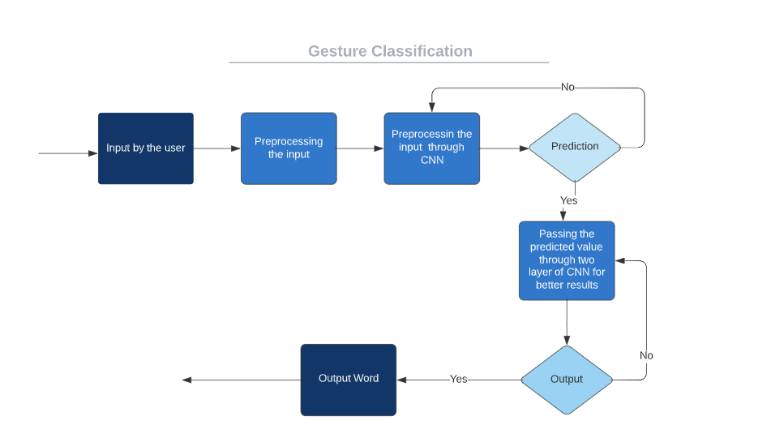

# Video-Calling-app-for-Deafeneds
## Abstract

Sign language is one of the oldest and most natural form of language for communication, but since most people do not know sign language and interpreters are very difficult to come by we have come up with a real time method using neural networks for fingerspelling based indian sign language on video calling app.
 
In this method, the hand is first passed through a classifier which predicts the class of the hand gestures. This method provides 98.00 % accuracy for many phrases like Thankyou, I Love You, No etc

## Project Description

Indian sign language is a predominant sign language Since the only disability D&M people have is communication related and they cannot use spoken languages hence the only way for them to communicate is through sign language. 

Communication is the process of exchange of thoughts and messages in various ways such as speech, signals, behavior and visuals. 

Deaf and Mute(Dumb)(D&M) people make use of their hands to express different gestures to express their ideas with other people. 

Gestures are the nonverbally exchanged messages and these gestures are understood with vision. This nonverbal communication of deaf and dumb people is called sign language. 

Sign language is a visual language and consists of 3 major components 


In this project I basically focus on producing a model which can recognize Finger, hand gestures, facial gestures in order to form a word by combining each gesture. 

The gestures I trained are as given in the image below.


### Train the Model
``` python
print("""python {}/research/object_detection/model_main_tf2.py --model_dir={}/{} --pipeline_config_path={}/{}/pipeline.config --num_train_steps=5000""".format(APIMODEL_PATH, MODEL_PATH,CUSTOM_MODEL_NAME,MODEL_PATH,CUSTOM_MODEL_NAME))
```
## Code For Image Processing
``` python
import cv2 
import numpy as np
category_index = label_map_util.create_category_index_from_labelmap(ANNOTATION_PATH+'/label_map.pbtxt')
cap.release()
# Setup capture
cap = cv2.VideoCapture(0)
width = int(cap.get(cv2.CAP_PROP_FRAME_WIDTH))
height = int(cap.get(cv2.CAP_PROP_FRAME_HEIGHT))
while True: 
    ret, frame = cap.read()
    image_np = np.array(frame)
    
input_tensor = tf.convert_to_tensor(np.expand_dims(image_np, 0), dtype=tf.float32)
detections = detect_fn(input_tensor)
    
num_detections = int(detections.pop('num_detections'))
detections = {key: value[0, :num_detections].numpy()
            for key, value in detections.items()}
detections['num_detections'] = num_detections

# detection_classes should be ints.
detections['detection_classes'] = detections['detection_classes'].astype(np.int64)

label_id_offset = 1
image_np_with_detections = image_np.copy()

viz_utils.visualize_boxes_and_labels_on_image_array(
                image_np_with_detections,
                detections['detection_boxes'], 
                detections['detection_classes']+label_id_offset,
                detections['detection_scores'],
                category_index,
                use_normalized_coordinates=True,
                max_boxes_to_draw=5,
                min_score_thresh=.5,
                agnostic_mode=False)

cv2.imshow('object detection',  cv2.resize(image_np_with_detections, (800, 600)))

    
if cv2.waitKey(1) & 0xFF == ord('q'):
    cap.release()
    break
```
## Import Model 
```python
import tensorflow as tf

# Load the saved model
model = tf.saved_model.load('path/to/model.pb')

# Get the input and output tensors
inputs = model.signatures['serving_default'].inputs
outputs = model.signatures['serving_default'].outputs

# Prepare the input data (this example assumes a single input)
input_data = [[1.0, 2.0, 3.0]]

# Run the model
output_data = model(inputs=tf.constant(input_data))['output_0']

# Print the output
print(output_data)
```
## Flow Chart for Gesture Classification is as following




## Tech Stack
- Python
- Open cv
- Tensor Flow
- TF zoo model
- Object Detection
- Flutter

## Progress
- Project Webpage <br>
- Model Code in ipynb <br>
- Basic ML Model is ready, Named saved_model.pb.
- APP UI is ready.
- Hosted on Google Cloud using AMD Instance.
- Model is on upgarde.

## Team 
1. Pushpak Kumawat
2. Yatharth Gautham
3. Harsh Gupta
4. Aditya Gupta

## License

1pushpak1/Video-Calling-app-for-Deafeneds is licensed under the
MIT License
A short and simple permissive license with conditions only requiring preservation of copyright and license notices. Licensed works, modifications, and larger works may be distributed under different terms and without source code.
